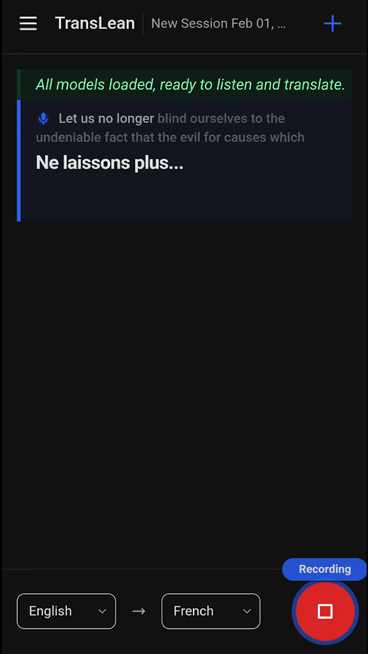

# TransLean 🎧🌍

## 1. Overview
TransLean is a self-hosted, real-time speech transcription **and** live translation service. Speak into your browser, and it:

- **Streams your microphone audio** to a Whisper-powered backend for transcription.
- **Translates the live transcript** with an Ollama-hosted LLM such as TranslateGemma or Qwen3.
- **Pushes live paragraph updates** back to the browser so you can read along.
- **Saves conversations** with titles and summaries so you can read or resume later.
- **“Enchant” function** lets you recreate a conversation’s translation and summarize it without re-recording.

The application is protected with an OID -based authentication. You can use your own setup, or e.g. Google Auth for that.

Think of it as a friendly on‑prem “live caption + translation booth” you can run at home or in a private server room. You bring the microphone, TransLean brings the magic. ✨



## Utility scripts

- `scripts/tts-gen.py` generates audio from text (or timecoded word lists) using gTTS and exports WebM/Opus or other formats supported by FFmpeg (requires ffmpeg/ffprobe on PATH).

## 2. System requirements

### Hardware overview
| Hardware tier | Recommended Whisper model | Recommended translation model | Notes |
| --- | --- | --- | --- |
| **CPU only** | `small` or `medium` | Smallest Ollama model you can tolerate | Expect higher latency. Consider shorter sessions. |
| **RTX 8GB** | `small` / `medium` | 2–7B class model (smallest available) | Good for light workloads or short meetings. |
| **RTX 16GB** | `large-v3` | `translategemma:12b` (default) | Proven workable on laptop-class 4090 16GB, with careful batching. |
| **RTX 24GB+** | `large-v3` | `translategemma:12b` (default) or `qwen3:14b` | Best quality + stability with extra headroom. |

### Software prerequisites
- **Docker + Docker Compose** (recommended for the main stack)
- **Python 3.11+** with `venv` (for local backend work)
- **Node.js 18+** (for the web client dev server)
- **FFmpeg** (for audio transcoding into 16 kHz PCM)

> All configuration is driven by environment variables. You can swap models or endpoints without code changes.

## 3. Step-by-step installation

### Step 0 — Clone the repo
```bash
gh repo clone truburt/translean
cd translean
```

### Step 1 — Configure environment variables
Copy the sample `.env` and update values for your environment.

```bash
cp .env.example .env
```

Key variables to review:
- **Database**: `DATABASE_URL`
- **Whisper**: `WHISPER_BASE_URL`, `WHISPER_MODEL`
- **LLM**: `OLLAMA_BASE_URL`, `LLM_MODEL_TRANSLATION`
- **Authorization**: `OIDC_*`

### Step 2 — Start the main stack (API + DB + web)
```bash
docker compose up --build
```
Open the web UI at `http://localhost:5173` (or your configured `FRONTEND_PORT`).

### Step 3 — Run Whisper locally (optional, recommended for best latency)
Two options are included in this repo:

**Option A: GPU-friendly bundled tools (recommended)**
```bash
docker compose -f aitools/docker-compose.yml up -d
```
- Runs a `faster-whisper-server` on port 8000.
- Set `WHISPER_BASE_URL=http://<host>:8000` in `.env`.

**Option B: Standalone faster-whisper server**
```bash
cd faster-whisper-server
MODEL_NAME=Systran/faster-whisper-large-v3 \
DEVICE=cuda \
COMPUTE_TYPE=bfloat16 \
NUM_WORKERS=1 \
MODEL_TTL=3600 \
MODEL_PRELOAD=true \
docker compose up --build
```
This standalone server ships with the repo and exposes `/transcribe` for batch requests, plus the same model/compute tuning used in the bundled tools.

### Step 4 — Run Ollama
Install Ollama and pull a translation model (example):
```bash
ollama pull translategemma:12b
```
Then set:
```
OLLAMA_BASE_URL=http://<host>:11434
LLM_MODEL_TRANSLATION=translategemma:12b
```

### Step 5 — Local development (optional)
**Backend**
```bash
python3 -m venv .venv
source .venv/bin/activate
pip install -r backend/requirements.txt
cd backend
alembic upgrade head
uvicorn app.main:app --reload
```

**Frontend**
```bash
cd web
npm install
npm run dev -- --host --port 5173
```

## 4. Architecture & implementation overview

TransLean is split into three cooperative services:

1. **Web client (Vite + Tailwind)**
   - Records audio in the browser.
   - Sends chunks over WebSocket to `/ws/stream`.
   - Renders paragraph‑level updates and translations in real time.

2. **Backend API (FastAPI + async SQLAlchemy)**
   - Accepts streaming audio frames.
   - Manages conversations, titles, summaries, and history.
   - Stabilizes Whisper output and translates paragraphs.

3. **AI services (Whisper + Ollama)**
   - **Whisper** handles speech-to-text via the bundled `faster-whisper-server` (Docker) or the standalone FastAPI server in `faster-whisper-server/`.
   - **Ollama** handles translation and summarization.

### Streaming workflow (high level)
- The browser streams audio frames to `/ws/stream`.
- The backend buffers and transcodes audio into 16 kHz PCM.
- Whisper produces short **preview** and longer **stable** transcripts.
- Stable snapshots are **translated** and stored per paragraph.
- The client receives live updates, stabilizes paragraphs, and persists history.
- **Enchant** function rebuilds the transcription and translation for the whole conversation, and creates a summary.

## 5. FAQ

**Q: Does TransLean require 3rd party cloud services?**  
A: Nope. Everything runs locally or on your own infrastructure. You control all endpoints via environment variables.

**Q: Can I use my own Whisper or translation model?**  
A: Yes! Point `WHISPER_BASE_URL`, `WHISPER_MODEL`, `OLLAMA_BASE_URL`, and `LLM_MODEL_TRANSLATION` to whatever models you want.

**Q: What browsers are supported?**  
A: Modern Chromium, Firefox, and Safari. The client automatically picks the best recording format and falls back to PCM streaming when needed.

**Q: Do I need a GPU?**  
A: CPU-only setups are functional but slow. For best live‑translation experience, use a GPU with at least 16GB of VRAM.

**Q: Where are conversations stored?**  
A: In your configured PostgreSQL database (or SQLite if you set it that way). You can list, resume, delete, and rebuild conversations via REST endpoints.

## License

TransLean is released under the PolyForm Noncommercial License 1.0.0. It uses a set of 3rd party dependencies such as ffmpeg and PostgreSQL. See `LICENSE` for details.
