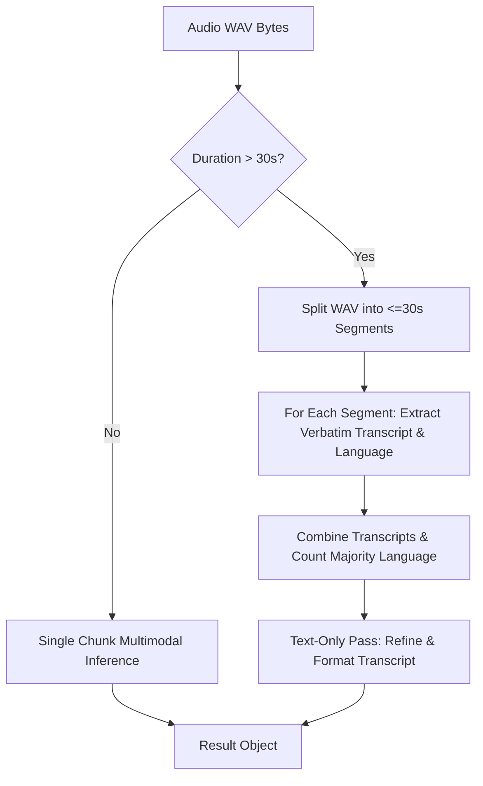

# AI Inference and Chunking

Siavox coordinates with a local Ollama service using the `gemma4:e4b` instruction-tuned model. Gemma 4 includes a native audio encoder, allowing it to ingest base64-encoded audio clips directly via the image/multimodal parameter inside the chat payload.

---

## 1. Ollama Chat API payload structure

To process audio, the backend dispatches a non-streaming POST request to the Ollama chat endpoint (`/api/chat`). The WAV file is encoded to base64 and inserted into the `images` array parameter:

```json
{
  "model": "gemma4:e4b",
  "messages": [
    {
      "role": "user",
      "content": "<PROMPT_INSTRUCTIONS>",
      "images": ["UklGRp6DAABXQVZFZm10IBIAAAABAA..."]
    }
  ],
  "format": "json",
  "stream": false
}
```

### Prompt Engineering Protocol
The system enforces strict formatting guidelines using system-like instructions within the user prompt. The prompt directs the model to:
1. Perform transcription of the audio file verbatim.
2. Detect the source language (e.g., `'English'`, `'Spanish'`).
3. Determine the translation target language (defaulting to the source language unless user custom overrides or translation configs request otherwise).
4. Perform structural text transformation:
   * **Note**: Generate a structured, clean bulleted summary or outline of the spoken content.
   * **Message**: Rephrase the transcription into a polished, natural message format ready for instant SMS/Slack dispatch.
5. Translate the final `transformed_text` to the target language if a translation is required.

The model is restricted to returning a raw JSON string adhering to this schema:
```json
{
  "raw_transcript": "the verbatim transcription",
  "source_language": "detected source language",
  "target_language": "determined target language",
  "transformed_text": "the finalized, formatted, and translated output"
}
```

---

## 2. 30-Second Audio Limit & Chunking Algorithm

The audio encoder in Gemma 4 is optimized for short utterances and will fail or truncate inputs that exceed **30 seconds** in duration. To handle long-form recordings, the backend implements an automatic audio-splitting pipeline inside `backend/app/ollama_client.py`.



### Segmentation Implementation
* **Header Inspection**: Using the native Python `wave` module, Siavox inspects the WAV file metadata:
  * Number of channels (`nchannels`)
  * Sample width in bytes (`sampwidth`)
  * Frame rate (`framerate`)
  * Total frame count (`nframes`)
* **Duration Calculation**: The duration is verified via:
  $$\text{Duration (seconds)} = \frac{\text{nframes}}{\text{framerate}}$$
* **Chunk Extraction**: If the duration is $> 30.0$ seconds, the file is segmented into sub-buffers. Each sub-buffer contains at most `int(30.0 * framerate)` frames.
* **Header Writing**: Each chunk is saved in memory as a complete WAV file by copying the original file's `nchannels`, `sampwidth`, and `framerate` to preserve proper playback encoding.

### Multi-Stage Inference Flow for Long Audios
When audio chunking is triggered, the pipeline switches from a single-stage query to a multi-stage workflow:

#### Phase A: Segment Transcription (Concurrent/Sequential)
For each chunk, the backend encodes the segment buffer as base64 and queries Ollama to retrieve the segment's verbatim transcription and detected language.
* **Payload format constraint**:
  ```json
  {
    "raw_transcript": "the verbatim transcription of this audio segment",
    "source_language": "detected source language"
  }
  ```

#### Phase B: Context Merger
Once all segments have completed execution, the text transcripts are combined with a spacing delimiter:
```python
combined_transcript = " ".join(raw_transcripts)
```
The overall source language is determined by performing a majority voting evaluation on the list of segment language strings using `collections.Counter`:
```python
detected_source_language = Counter(source_languages).most_common(1)[0][0]
```

#### Phase C: Text-Only Refinement
The combined transcription string is sent to Ollama in a final text-only chat completion call (omitting the `images` payload) to structure the text into the requested format (Note/Message) and translate it if needed.
* **Refinement Prompt Payload**:
  ```json
  {
    "source_language": "detected source language",
    "target_language": "determined target language",
    "transformed_text": "the finalized, formatted, and translated output"
  }
  ```
The resulting structured output is then returned to the client and persisted in the SQLite history.
