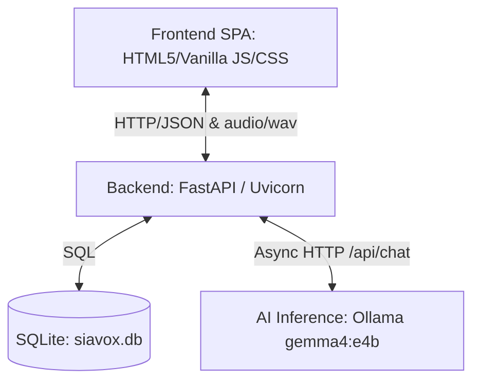
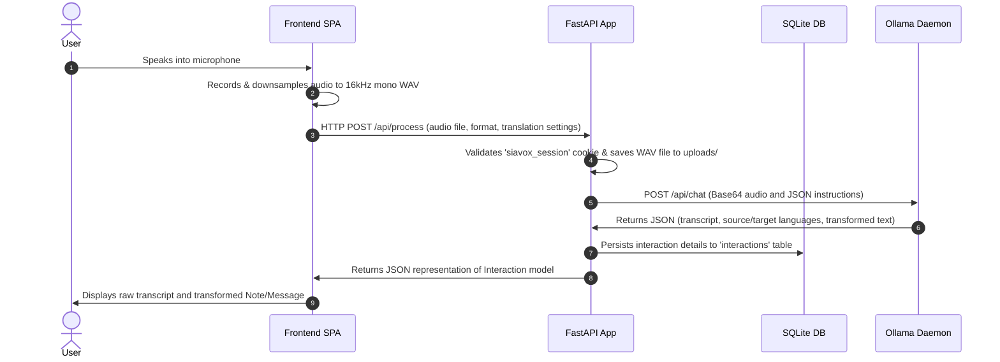

# Architecture and Data Flow

This document details the system-level design, components, network layout, and data lifecycle of the Siavox application.

## Component Architecture

Siavox is comprised of three core execution layers:



1. **Frontend SPA**: A single-page application built using semantic HTML5, Vanilla CSS, and modern JavaScript. For production, it is served by an **Nginx** web server. For local development, it can be served directly by FastAPI's `StaticFiles` mount.
2. **Backend Service**: A **FastAPI** web framework running on **Uvicorn** that handles route dispatching, database persistence, session validation, and model execution orchestration.
3. **AI Inference Layer**: A local **Ollama** server hosting the `gemma4:e4b` model (Gemma 4 with a 4B Effective parameter footprint and native multimodal audio encoder).

---

## Network & Docker Compose Topology

Siavox is designed to run locally or containerized via `docker-compose.yml`.

### Docker Compose Mode
* **Nginx Container**: Listens on port `80` of the host. Serves frontend static content directly and proxies any incoming `/api/...` and `/static/...` traffic to the FastAPI backend container.
* **FastAPI Container**: Runs inside the Docker network. Listens internally on port `8000`. Writes database transactions to the SQLite file `siavox.db` which is bound to a persistent volume.
* **Inference Endpoint**: Communicates with the host machine's Ollama instance over the bridge network boundary. The environment variable `OLLAMA_HOST` is explicitly set to `http://host.docker.internal:11434` to enable container-to-host network routing.

### Local VS Code Debug Mode
* The FastAPI server is started directly on the host using `uvicorn` (port `8000`).
* `OLLAMA_HOST` defaults to `http://localhost:11434` to access the local Ollama daemon.
* FastAPI mounts the `frontend` folder at the root `/` to serve UI assets on port `8000` without requiring an Nginx instance.

---

## End-to-End Data Flow

The lifecycle of an audio request follows a strict sequence:



1. **Vocal Input**: The user initiates a recording. The browser's media API feeds raw microphone data into a custom buffer.
2. **On-the-fly Resampling**: When recording stops, the frontend flattens the PCM buffer, downsamples it to **16,000 Hz**, encodes it into a standard **16-bit mono signed integer WAV file**, and outputs a Blob of mime-type `audio/wav`.
3. **Transmission**: The Blob is appended to a `FormData` payload containing the requested format (`note` or `message`), target translation language, and any custom text prompts. It is dispatched to `/api/process` via `fetch()`.
4. **Session Inspection**: The backend verifies the caller's session by inspecting the HTTP-only `siavox_session` cookie. If valid, the audio file is stored under `uploads/` using the naming pattern `{user_id}_{timestamp}_{original_filename}`.
5. **AI Inference & Format Synthesis**: The backend invokes `OllamaClient`. Depending on audio duration, the buffer is processed directly or split into chunks before generating the prompt schema. The request asks Gemma 4 for structured JSON conforming to:
   ```json
   {
     "raw_transcript": "verbatim text",
     "source_language": "detected source language",
     "target_language": "target language",
     "transformed_text": "refined format output"
   }
   ```
6. **Persistence**: The transaction is committed to the SQLite database via SQLAlchemy. The record saves the file's static URL (`/static/uploads/...`), language settings, raw transcription, and transformed output.
7. **Client Feedback**: The backend returns the serialized database record to the client SPA. The UI populates the output pane and updates the user's sliding historical drawer.

---

## Authentication and Security Boundary

* **Identity Verification**: Done via Google One-Tap Sign-In. The client sends the ID token to `/api/auth/google`. The backend validates the signature and issuer fields (`accounts.google.com`) using `google-auth` library credentials.
* **Developer Sandbox Bypass**: If `GOOGLE_CLIENT_ID` in `.env` is unconfigured, or the incoming token is prefixed with `mock_token_`, `auth.verify_google_token()` bypasses JWT checks and signs in a mock user (`testuser@example.com` or custom mock email) for local offline development.
* **Session Persistence**: Sessions are secured using an HTTP-Only cookie `siavox_session` matching the user's email. Secure flag is set to `False` in local dev and must be set to `True` when deploying to HTTPS production hosts.
