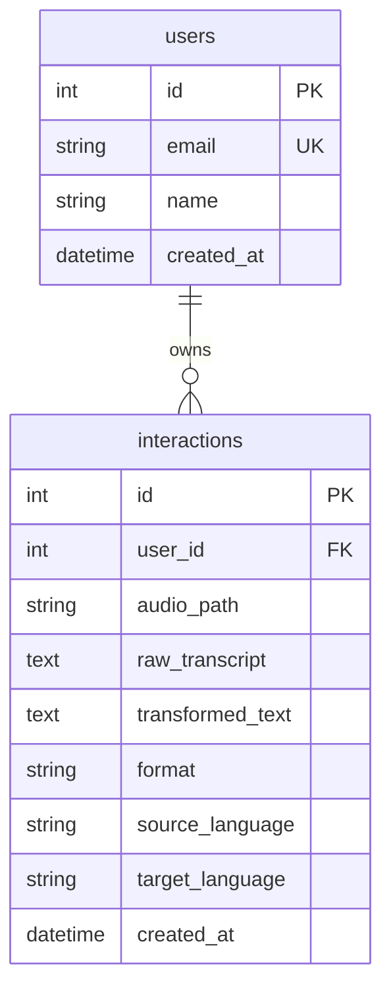

# Backend and Database Architecture

The Siavox backend is built using the **FastAPI** web framework and runs under the **Uvicorn** ASGI server. Data storage is handled by **SQLite** via the **SQLAlchemy** Object-Relational Mapper (ORM).

---

## 1. Configuration Management

Configuration is handled using Pydantic Settings (`pydantic-settings` package) in [config.py](file:///wsl.localhost/Ubuntu-24.04/home/truburt/dev/translean/siavox/backend/app/config.py). Variables are loaded from environmental values with a fallback to the `.env` file located in the workspace root:

```python
class Settings(BaseSettings):
    GOOGLE_CLIENT_ID: str = "your-google-client-id.apps.googleusercontent.com"
    OLLAMA_HOST: str = "http://localhost:11434"
    OLLAMA_MODEL: str = "gemma4:e4b"
    DATABASE_URL: str = "sqlite:///./siavox.db"
    SECRET_KEY: str = "dev-secret-key-1234567890-change-in-production"
    SESSION_COOKIE_NAME: str = "siavox_session"
```

---

## 2. Lifespan Event and DB Setup

The application uses the modern `contextlib.asynccontextmanager` hook inside [main.py](file:///wsl.localhost/Ubuntu-24.04/home/truburt/dev/translean/siavox/backend/app/main.py) to manage database initialization:

```python
@asynccontextmanager
async def lifespan(app: FastAPI):
    init_db() # Registers tables on startup
    yield
```

---

## 3. Database Schema

Tables are mapped using SQLAlchemy declarative models in [db.py](file:///wsl.localhost/Ubuntu-24.04/home/truburt/dev/translean/siavox/backend/app/db.py). The schema contains two tables: `users` and `interactions`.



### Table definitions:
* **`User`** (`users` table):
  * `id`: Integer, primary key.
  * `email`: String, unique index, non-nullable.
  * `name`: String, nullable.
  * `created_at`: DateTime, defaults to timezone-naive UTC timestamp: `datetime.now(timezone.utc).replace(tzinfo=None)`.
  * `interactions`: Relationships to the `Interaction` table configured with `cascade="all, delete-orphan"`.
* **`Interaction`** (`interactions` table):
  * `id`: Integer, primary key.
  * `user_id`: Integer, foreign key referencing `users.id`, non-nullable.
  * `audio_path`: String, stores the static URL reference to the stored audio file (e.g. `/static/uploads/1_171694000_audio.wav`).
  * `raw_transcript`: Text, raw verbatim translation.
  * `transformed_text`: Text, finalized, formatted, and translated output text.
  * `format`: String, either `"note"` or `"message"`.
  * `source_language`: String, detected language (e.g. `'English'`).
  * `target_language`: String, destination language (e.g. `'Spanish'`).
  * `created_at`: DateTime, defaults to timezone-naive UTC timestamp.

---

## 4. API Endpoints

All API endpoints are prefixed with `/api`. Static assets are served via FastAPI `StaticFiles` mounts.

### Health Route
* **`GET /api/health`**: Tests connection to the database and evaluates connectivity to the local Ollama instance (returns `ollama_connected: true/false`).

### Authentication Routes
* **`POST /api/auth/google`**: Receives Google ID JWT credential tokens. Validates signature/issuer, fetches user record (creating it if absent), and sets an HTTP-Only cookie `siavox_session` populated with the user email.
* **`POST /api/auth/logout`**: Deletes the `siavox_session` cookie from the client browser.
* **`GET /api/auth/me`**: Returns the profile details of the authenticated caller, or `{ "authenticated": false }`.
* **`GET /api/auth/config`**: Public endpoint returning the configured `google_client_id` for GIS integration initialization.

### Interaction Routes
* **`GET /api/history`**: Returns the chronological log of all interactions owned by the currently authenticated user session. Ordered descending by `created_at`.
* **`POST /api/process`**: Ingests form data payloads. Parameters:
  * `file`: Multipart/form-data audio file.
  * `format`: String, `"note"` or `"message"`.
  * `target_language`: String, defaults to `"auto"`.
  * `custom_instructions`: String, optional user instructions.
  
  The endpoint saves the file locally in `uploads/` named as `{user_id}_{timestamp}_{original_filename}`, calls `OllamaClient.process_audio()`, writes the return tuple to the database, and returns the serialized `Interaction` model representation.
